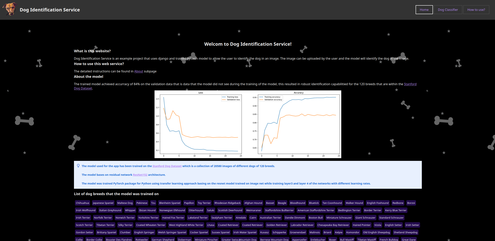
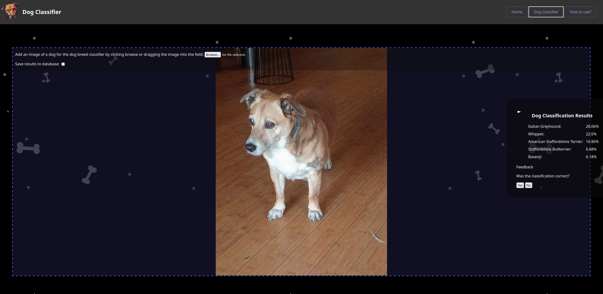

# Dog indetification Service

This is a django web app project that connects ML model trained using pytorch with a web application that allows to classify dog breeds based on the photos uploaded by the user.





# Setup

## Requirements
Project was deeloped with Python 3.11.8 so its best to install it using that version. Requirements can be installed using

```
pip3 install -r requirements.txt
```

Or alternatively if only training the model using `train_dog_classifier.ipynb` with:

```
pip3 install -r model_requirements.txt
```

## Running the service

Once the requirements are installed one should first create migration to ensure SQLite databsase is configure correctly:

```
python manage.py migrate
```

And then run the service using:

```
python manage.py runserver 0.0.0.0:8080
```

## Dockerfile

Additionallyservice cna also be compiled into a docker image using `Dockerfile`:

```
docker build -t <TAG> -f Dockerfile .
```