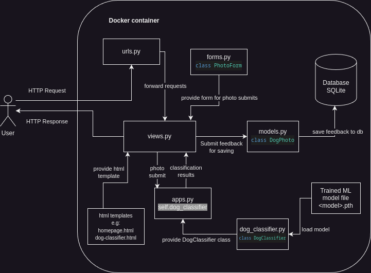

# Dog indetification Service

This is a django web app project that connects ML model trained using pytorch with a web application that allows to classify dog breeds based on the photos uploaded by the user.


# Project Structure

Project has the follwoing structure
- root
    - `dogidentificationapp` - Django app directory.
        - `static` - contains all static files (images, css, JavaScript).
        - `models` - Contains class information as well as trained models in pytorch format .pth.
        - `apps.py` - Defines core app information as well as setup where model is loaded.
        - `dog_classifier.py` - menages loading and interacting with ML model.
        - `forms.py` - defines image upload forms that are used to get images from user.
        - `models.py` - defines model of database that stores user feedback
        - `setting.py` - django settings.
        - `urls.py` - defines all urls on the webpage.
        - `views.py` - hanldes serving static views from html templates to the user with classification details
        - `tests.py` - contains tests using django.test
    - `Dockerfile` - Dockerfile for creating an image of the app if one wishes to run it within a container.
    - `train_dog_classifier.ipynb` - Jupyter Notebook used to train the model
    - `requirements.txt` - contains requirements for running the project (webpage)
    - `model_requirements.txt` - contains requirements only for training the model
    - `documentation.pdf` - contains documentation of the project.


# Setup

## Requirements
Project was deeloped with Python 3.11.8 so its best to install it using that version. Requirements can be installed using

```
pip3 install -r requirements.txt
```

Or alternatively if only training the model using `train_dog_classifier.ipynb` with:

```
pip3 install -r model_requirements.txt
```

## Running the service

Once the requirements are installed one should first create migration to ensure SQLite databsase is configure correctly:

```
python manage.py migrate
```

And then run the service using:

```
python manage.py runserver 0.0.0.0:8080
```

## Dockerfile

Additionallyservice cna also be compiled into a docker image using `Dockerfile`:

```
docker build -t <TAG> -f Dockerfile .
```

# Subpages on the website
- `/` - homepage describing the model and which breed can the model classify.
- `/dog/` - Dog classifier webpage with core functionality.
- `/about/` - Contains how-to-use instructions for the webpage.

# ML Model architecture

ML model used for the final app is a modified [ResNet152](https://arxiv.org/abs/1512.03385) where layer 3 and layer 4 were unfrozen for training on the Stanford Dog Dataset. Detailed data augmentation, hyperparameters and methods used to process are documented in [train_dog_classifier.ipynb](train_dog_classifier.ipynb) used for training of the model.

# High level design



# Methods documentation

## [`views.py`](dogidentificationapp/views.py)

This subsection contains detailed description of methods witin the views.py file which handles serving html templates to the user. Specific call to each of the methods within this module can be seen within the [`urls.py`](dogidentificationapp/urls.py).

### `homepage` `aboutpage`

Those methods serve just static html templates ([`homepage.html`](dogidentificationapp/templates/homepage.html) and [`aboutpage.html`](dogidentificationapp/templates/aboutpage.html) respectively) with parameters such as tille or classes (dog breeds) for displaying them to the user. 

### `classify_dogs`

Method containing core logic of the service whenever. It is called when the user submits the photo via 'drag-and-drop' or upload button as well as via `upload_example` wheneve user clisks on the example photo.

First the method loads the data from the form (photo) then it calls on [`dog_classifier.py`](dogidentificationapp/dog_classifier.py) to idenity the dog breed based on the submitted photo. The reulst are then filtered and scliced to contain only top 5 results. They are then returned to the user with the [`dog_classifier.html`](dogidentificationapp/templates/dog_classifier.html) template.

### `submit_feedback`

This method hanldes saving user feedback on classification once he agrees to do that. Method hanldes the following cases:
- when user already saved the photo earlier by marking the checkmark before the upload,
- whenver the user hasnmt agreed to save the photo to database yet.

In the second case the method will prompt a javascript alert asking the user whether he would like this feedback data saved or not. If the user agrees the method saves the data to SQLite databse, otherwise `refuse_saving_of_data` is called.

### `refuse_saving_of_data`

The service does not save the data for feedback by default, this method is called whenever user refuses to submit his photo as feedback and only marks a flag within the session to not display the question whether the user would like to save data again.

### `upload_example`

The method handles serving results for the example photos in `/dogs/` subpage. It prepares an imitation of a real form with the chosed example photos and then calls `classify_dogs` with the faked form.

## [`dog_classifier.py`](dogidentificationapp/dog_classifier.py)

This subsection describes `DogClassifier` class of `dog_classifier.py` module used for interacting with the trained ML model.

### `__init__`

When initializing the module `model_path` and `class_names_path` need to be submitted containing paths to model and class descriptions respectively. The method then tries to laod the model as well as class labels based on the given data and thros an exception whenever it fails to do so.

### `classify_dog`

The method takes as the argument the preprocessed photo, it then calls on the model loaded when initializing the class to classify the submitted image. It returns sorted results with labels.